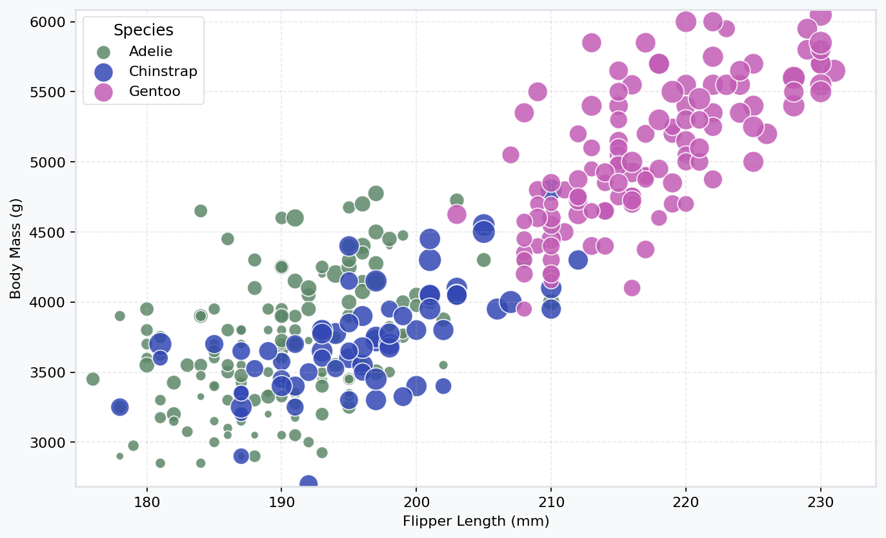
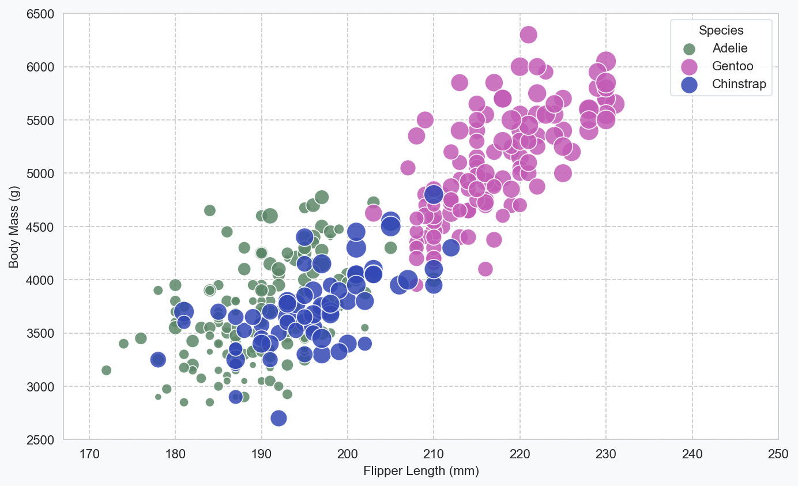
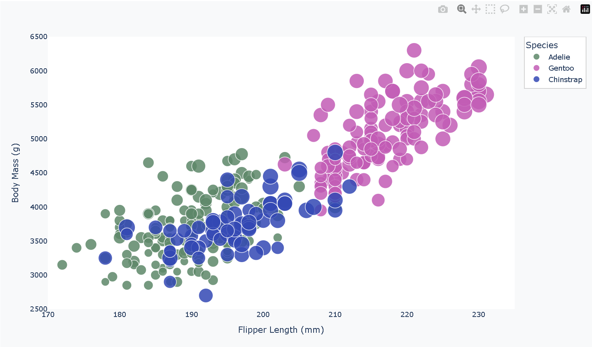
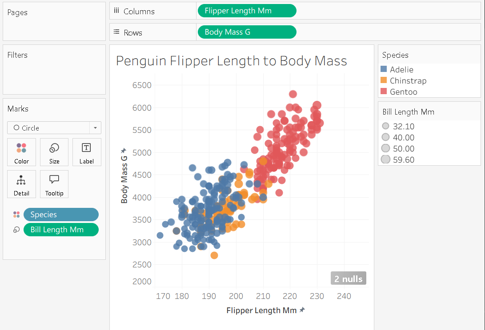
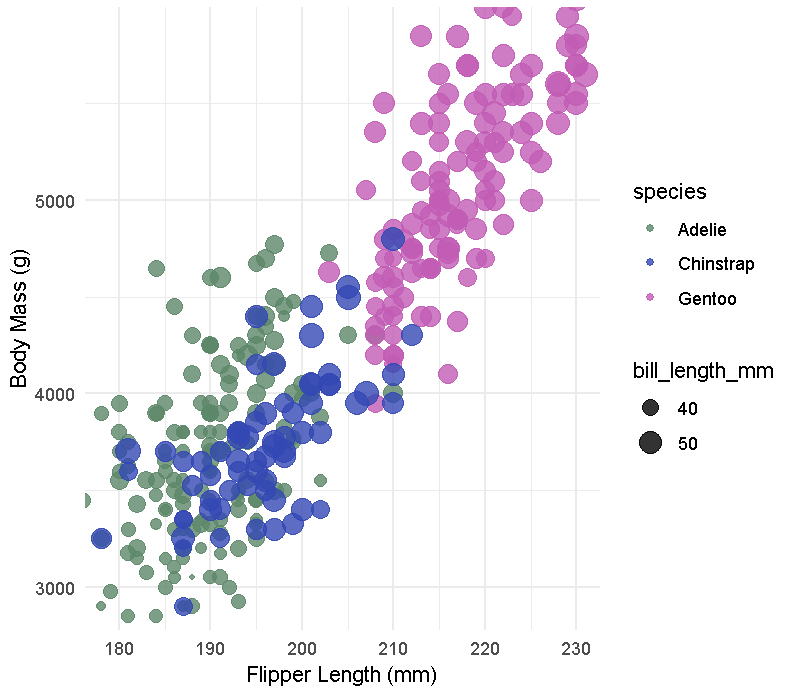

Elias Montas
CS4804
Assignment 2 - Data Visualization, 5 Ways  

---

The goal of this assignment was to recreate the same scatterplot using multiple different visualization tools and/or libraries. The purpose I believe was to compare how different tools fare at handling visualizations and to then gauge their strengths and weaknesses through experience.

# Pandas Scatterplot

I used the pandas plotting interface to quickly generate a scatterplot right from the dataset. I think that pandas as a library made it easy to produce a quick visualization with both minimal code and staying straightforward. Pandas is most useful for fast exploratory visualizations.

# Seaborn Scatterplot

While looking for libraries I could potentially use on this assignment, I came across seaborn. It also gave a (similar to pandas) straightforward way to map multiple variables to properties. For example, bill length to marker size. Seaborn did not require that much code while also producing a clean and arguably professional result. The library itself is mostly useful for statistical graphics and similar to pandas, exploratory data analysis.

# Plotly Scatterplot

The plotly visualization was created using Pythons plotly library. I am more confident using Python than I am using R so thats why I chose Python over R. I appreciate plotly because it adds interactivity within the visualization. For example, you can hover over data points with the html file and you will get the data points' information. I think that this added interactivity was a technical achievements that distinguishes it from the other scatterplots I've created in this assignment. If user interaction is beneficial for a project, I would surely use Plotly.

# Tableau Scatterplot

For my non-library entry, I chose Tableau. It is a software that I recently started using in other courses at WPI and I wanted to try my hand at it in this assignment as well. The visualization using Tableau was relatively easy to make, as Tableau has a very user-friendly drag-and-drop interface. It is also very interactable in terms of making adjustments to the visualization. I think that although it was very quick to make, Tableau loses out to the other libraries I chose in this assignment when it comes to how precise you can make your visualization. Tableau works great for dashboard and other interactive visualizations though.

# R ggplot2 Scatterplot

I used ggplot2 to make my last scatterplot. I think ggplot2 made it much easier to map multiple variables while maintaining its consisten styling. While using relatively little scripts, I was able to produce a clean visualization thats usable for exploratory analysis.

# Technical Achievements

- Mapped multiple variables across five tools/libraries/etc
- Maintained consistent axis scaling across all visualizations
- Adjusted the size of scale for readability

# Design Achievements

- Used a consistent color scheme for species across each of the visualizations
- Clear units and labeling
- Consistent scales for comparison

